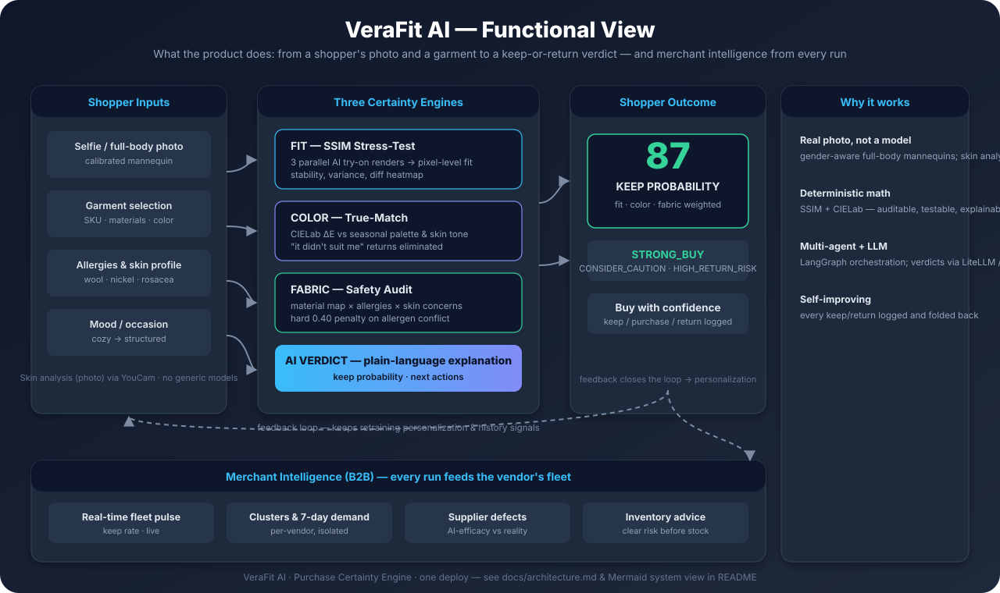
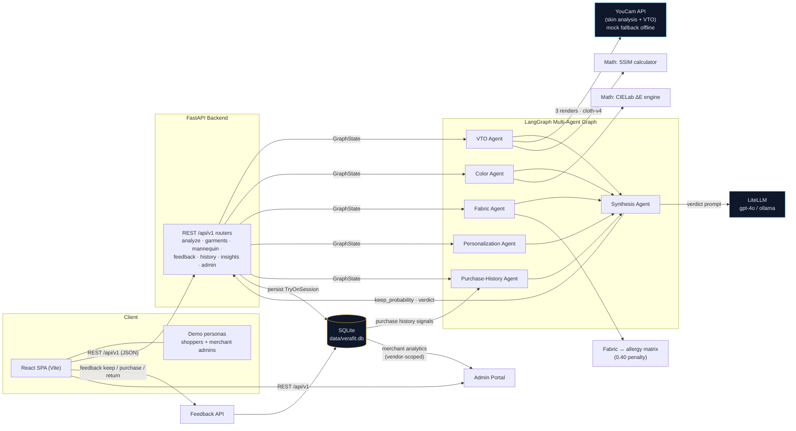

<p align="center">
  
</p>

<h1 align="center">VeraFit AI — Purchase Certainty Engine</h1>

<p align="center">
  <b>Every returned garment is a failed prediction. VeraFit makes the prediction before the purchase.</b>
</p>

<p align="center">
  <a href="docs/architecture.md"><b>Architecture</b></a> ·
  <a href="docs/setup.md"><b>Setup</b></a> ·
  <a href="docs/roadmap.md"><b>Roadmap</b></a> ·
  <a href="docs/presentation.pdf"><b>Presentation (PDF)</b></a> ·
  <a href="assets/functional-view.svg"><b>Functional View</b></a>
</p>

<p align="center">
  <b>Fit</b> — SSIM stress-test on your photo &nbsp;·&nbsp; <b>Color</b> — CIELab true-match &nbsp;·&nbsp; <b>Fabric</b> — allergen-safe audit &nbsp;·&nbsp; <b>Verdict</b> — AI plain-language
</p>

> **Punchline:** *Know the return before the checkout — fit, color, and fabric, verified on a digital mannequin of the actual shopper.*

---

## 🧭 Functional View



**How a shopper goes from photo + garment to a Keep-Probability verdict** — and how every run feeds vendor-isolated merchant intelligence.

---

## 🗺️ System View (Mermaid)

Below is the system architecture and the **interactions across components**: the SPA talks REST to FastAPI, which orchestrates five parallel agents via LangGraph; VTO renders come from YouCam, deterministic scoring from the math engines, verdicts from LiteLLM — and every result persists to SQLite, feeding the merchant analytics and the shopper feedback loop.



---

## 🤖 The Agents

Six specialized agents make up the engine. **Five run in parallel** on every request; the **Synthesis Agent** fuses their outputs into the final verdict. The roles:

| # | Agent | Role in the workflow | Key outputs |
|---|---|---|---|
| 1 | **VTO Agent**<br>`agents/vto_agent.py` | Runs **3 parallel AI try-on renders** of the garment on the shopper's actual photo and stress-tests fit stability | `vto_renders`, `fit_repeatability_score` (SSIM), `ssim_variance`, `diff_heatmap_b64`, `is_fit_unstable` |
| 2 | **Color Agent**<br>`agents/color_agent.py` | Matches the garment color to the shopper's **seasonal palette & skin tone** using perceptual **CIELab ΔE** | `color_harmony_score`, `color_diagnostics`, `closest_palette_match`, `garment_lab`, `season_palette_hex` |
| 3 | **Fabric Agent**<br>`agents/fabric_agent.py` | Audits the **material map against allergies & skin concerns** (rosacea, eczema, friction/heat) | `fabric_safety_score`, `fabric_warnings`, `allergy_detected`, `allergy_multiplier` (hard **0.40** on conflict) |
| 4 | **Personalization Agent**<br>`agents/personalization_agent.py` | Applies the shopper's **fit preference, comfort-vs-style bias, and mood slider** | `personalization_delta`, `mood_scalar` (0.90–1.10) |
| 5 | **Purchase-History Agent**<br>`agents/history_agent.py` | Aggregates **past keep/return/purchase sessions** into evidence-backed signals | `purchase_learnings`, `purchase_recommendations`, `purchase_history_delta` |
| 6 | **Synthesis Agent**<br>`agents/synthesis_agent.py` | Fuses all five outputs into the **weighted master score**, picks the verdict, and generates the **plain-language AI explanation** (LiteLLM) | `keep_probability`, `verdict`, `breakdown_metrics`, `ai_explanation` |

> **Concurrency:** the first five are wired in parallel in `agents/workflow.py` — a `StateGraph` fan-out from `START` converging on the Synthesis Agent before `END`.

---

## 🎯 Why It's Unique

| Problem | Typical approach | VeraFit |
|---|---|---|
| "Will it fit?" | One try-on image, vibes | **3 parallel renders + SSIM variance + diff heatmap** — an unstable drape is detected mathematically |
| "Does the color suit me?" | Generic advice | **CIELab ΔE** against the shopper's calibrated seasonal palette & skin tone |
| "Is the fabric safe?" | Ignored | **Fabric-to-skin audit** against personal allergies (wool, nickel, synthetics…) with a hard **0.40** penalty when triggered |
| "Who returned it?" | Post-mortem spreadsheets | **Vendor-isolated real-time merchant analytics** that flag high-return-risk SKUs before stock is committed |
| Explainability | Black-box score | Every score is decomposed: SSIM matrix, ΔE, allergen warnings, plus an LLM-generated plain-language verdict |

---

## ✨ Key Features

1. **VTO Stress-Testing & SSIM Math Engine** (`math_engine/ssim_calculator.py`)
   - 3 parallel async VTO renders per request (YouCam `cloth-v4`, with deterministic mock fallback offline).
   - Grayscale SSIM across all render pairs; flags fit instability when average SSIM < 0.80 and renders pixel-difference heatmaps.

2. **Skin Analysis via YouCam** (`services/youcam_service.py`)
   - `POST /mannequin/analyze` runs **YouCam Skin Analysis** (`/s2s/v2.1/task/skin-analysis`) + **Facial Color Tones** (`/s2s/v2.0/task/skin-tone-analysis`) on the shopper's selfie.
   - Returns concern scores (redness, acne, oiliness, moisture, texture, pores), skin-tone hex, and warm/cool undertone → persisted to the mannequin profile.

3. **Color True-Match Engine** (`math_engine/color_engine.py`)
   - Garment hex → perceptual CIELab (`L*a*b*`); ΔE distance vs the user's seasonal profile (Cool Winter, Warm Autumn, …) and skin tone.

4. **Fabric-to-Skin Safety Engine** (`agents/fabric_agent.py`)
   - Material-composition map cross-referenced against allergies; hard **0.40** penalty multiplier on conflict; friction/heat-hold cross-checked against rosacea/eczema biometrics.

5. **Multi-Agent LangGraph Orchestration** (`agents/`)
   - VTO · Color · Fabric · Personalization · Purchase-History agents run **in parallel**, converge in the Synthesis agent → weighted master score + verdict (see [agent table](#-the-agents)).

6. **Multi-Provider LLM Verdicts (LiteLLM)**
   - OpenAI GPT-4o, Anthropic, Gemini, Groq, or local **Ollama** (`ollama/granite4.1:3b`) — with deterministic clinical-rule fallback.

7. **AI X-Ray Explainability Inspector**
   - Fit tab (SSIM matrix + heatmap) · Color tab (CIELab + ΔE + swatches) · Skin tab (allergens + friction alerts).

8. **Continuous Learning Feedback Loop** (`/history`)
   - Shoppers log keep / return / purchase with reasons (`FABRIC_ITCHY`, `FIT_TOO_TIGHT`, `COLOR_UNFLATTERING`, `POOR_QUALITY`) — recalibrates preference bias vectors in the DB.

9. **Gender-Aware Fidelity**
   - Gender-specific avatar & full-body mannequin pools; male shoppers get men's garment imagery in the VTO; every persona has a unique, real full-body photo.

10. **B2B Vendor-Isolated Admin** (`/admin`)
    - Per-vendor dashboards (Venice Luxury Atelier vs Nordic Organic Weaves) with real-time pulse, clusters + fleet KPIs, 7-day demand, supplier analytics, AI-efficacy, inventory clearance audits, cohort & B2B reports.

---

## 💎 Benefits

### For shoppers
- **Buy with confidence** — see the garment on *your* body, in *your* colors, against *your* skin before paying.
- **Fewer wasted purchases** — a honest `CONSIDER_CAUTION` beats an expensive regret; return-mileage, packaging waste, and restocking effort all shrink.
- **Personal, not generic** — gender-accurate full-body mannequins, seasonal palettes, and allergen-safe fabric advice tuned per person.
- **Understanding, not just a score** — every verdict is decomposed (fit/color/fabric) with a plain-language explanation.

### For merchants
- **Early warning on return-risk SKUs** — the dashboard flags problem garments *before* stock is committed, not after returns arrive.
- **Vendor-scoped intelligence** — real-time pulse, clusters, 7-day demand, supplier defects, AI-efficacy, and clearance advice for *your* fleet only.
- **Returns as a measured KPI** — track predicted vs realized keep-rate per SKU and prove the return-rate reduction.

### For the industry
- **A template for pre-purchase prediction** — turning returns from a post-hoc cost center into an explainable, pre-checkout signal.
- **Deterministic + auditable** — SSIM and CIELab math kernels are testable and explainable, not a black box.

---

## 🛠️ Tech Stack

| Layer | Technology |
|---|---|
| Backend | Python 3.14 · FastAPI · SQLAlchemy (async) · aiosqlite · pydantic-settings |
| Intelligence | LangGraph (6 agents) · LiteLLM · deterministic math kernels (scikit-image, OpenCV, NumPy) |
| Rendering & Skin | **YouCam AI Clothes VTO (`cloth-v4`)** + **YouCam Skin Analysis / Facial Color Tones** — with offline mock fallback |
| Frontend | React · TypeScript · Vite · Zustand |
| Delivery | Docker (single container) · docker compose · AWS (ECS Fargate / EC2) |
| Tests | pytest (10 tests) · `npm run typecheck` |

---

## 👥 Target Industry & Personas

**Target industry:** apparel & footwear e-commerce, multi-brand retail, and merchants with meaningful return costs.

| Role | Demo persona | What they get |
|---|---|---|
| Shopper | **Elena Vance** — luxury, Cool Winter, rosacea, wool/nickel allergies | Fit/color/fabric certainty before buying |
| Shopper | **Astrid Holm** — eco-naturalist, Warm Autumn, eczema | Eco-conscious, allergen-safe recommendations |
| Shopper | **Lars Hedlund** — minimalist menswear, sensitive skin | Gender-accurate men's try-on |
| Merchant admin | **Marcus Vance** — Venice Luxury Atelier (Italy) | Real-time fleet intelligence, return-risk early warning |
| Merchant admin | **Freja Lindqvist** — Nordic Organic Weaves (Sweden) | Vendor-scoped demand trends, inventory clearance advice |

---

## 🚀 Quick Start

```bash
cp .env.example .env          # then edit API keys / LLM provider

# Dev: backend + frontend
./scripts/start.sh            # backend :5194 · frontend :5193
./scripts/test.sh             # 10 pytest + frontend typecheck

# Docker: single container (UI + API + /docs on :5194)
docker compose up -d --build

# AWS: one-command deploy (Fargate + ALB, or EC2)
./scripts/deploy.sh
```

**Links**
- Frontend UI: http://localhost:5193
- Swagger API docs: http://localhost:5194/docs
- Health check: http://localhost:5194/health

Full local setup, troubleshooting, and env reference: **[docs/setup.md](docs/setup.md)**.

---

## 🗺️ Roadmap

**Shipped:** M1 core certainty engine · M2 vendor-isolated merchant analytics · M3 container + AWS delivery + docs.

**Next:** M4 hardening (auth, migrations, Postgres, S3, HTTPS, CI/CD) → M5 deeper prediction (auto-calibration, generative 3D fit, fabric KB) → M6 network effects (fleet intelligence marketplace, return-insurance scoring).

See **[docs/roadmap.md](docs/roadmap.md)**.

---

## 📺 Demos & Media

- 📄 [Investor / Demo presentation (PDF)](docs/presentation.pdf) — generated from `docs/presentation.html` (print-to-PDF, slide-sized).
- 🎬 [Video walkthrough](https://youtu.be/PdCjiCqF1f0)
- 🗺️ [Architecture documentation](docs/architecture.md) · [System diagram](assets/system-diagram.svg) · [Functional view](assets/functional-view.svg)

---

## 📁 Repository Structure

```text
youcam/
├── backend/
│   ├── app/
│   │   ├── agents/          # LangGraph multi-agent nodes & graph (6 agents)
│   │   ├── math_engine/     # SSIM + CIELab deterministic kernels
│   │   ├── routers/         # REST v1 (analyze, garments, mannequin, feedback, history, insights, admin)
│   │   ├── services/        # YouCam client (VTO + skin), seeding, gender-aware imagery pools
│   │   └── main.py          # FastAPI app + SPA static serving
│   └── tests/               # pytest suite
├── frontend/src/            # React · Vite · TS (Fitting Room, Calendar, History, Learnings, Mannequin, Admin)
├── scripts/                 # start/stop/restart · test · seed · deploy.sh
├── data/                    # SQLite DB + JSON seed catalogs
├── docs/                    # architecture · setup · roadmap · presentation (html + pdf)
├── assets/                  # logo · functional view · system diagram
├── Dockerfile · docker-compose.yml
└── .env / .env.example
```

---

## 📄 License

[MIT](LICENSE) © 2026 Sam
