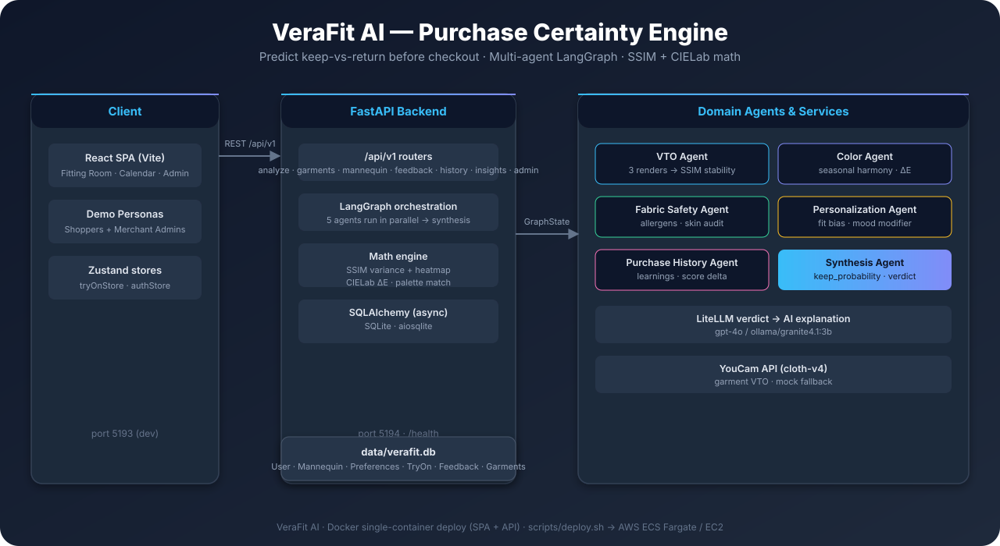

# VeraFit AI — Purchase Certainty Engine

> **Know the return before the checkout.** VeraFit converts generative Virtual Try-On (VTO) into a deterministic, explainable **Keep-Probability Score (0–100%)** — a multi-agent system that stress-tests fit, color harmony, and fabric-to-skin safety on a calibrated digital mannequin of the actual shopper, then predicts whether a garment will be kept or returned.

[Architecture](docs/architecture.md) · [Setup Guide](docs/setup.md) · [Roadmap](docs/roadmap.md) · [Presentation](docs/presentation.html) · [System Diagram](assets/system-diagram.svg)

---

## System Overview



- **Shopper side:** AI try-on on *your* full-body photo, color match to *your* seasonal palette, fabric audit against *your* allergies — a single Keep Probability with an honest verdict.
- **Merchant side:** a B2B Admin dashboard where each retailer sees *only their own fleet* — real-time pulse, clusters, 7-day demand, supplier defects, and inventory clearance advice.

---

## Why It's Unique

| Problem | Typical approach | VeraFit |
|---|---|---|
| "Will it fit?" | One try-on image, vibes | **3 parallel renders + SSIM variance + diff heatmap** — an unstable drape is detected mathematically |
| "Does the color suit me?" | Generic advice | **CIELab ΔE** against the shopper's calibrated seasonal palette & skin tone |
| "Is the fabric safe?" | Ignored | **Fabric-to-skin audit** against personal allergies (wool, nickel, synthetics…) with a hard 0.40 penalty when triggered |
| "Who returned it?" | Post-mortem spreadsheets | **Vendor-isolated real-time merchant analytics** that flag high-return-risk SKUs before stock is committed |
| Explainability | Black-box score | Every score is decomposed: SSIM matrix, ΔE, allergen warnings, plus an LLM-generated plain-language verdict |

---

## Key Features

1. **VTO Stress-Testing & SSIM Math Engine** (`backend/app/math_engine/ssim_calculator.py`)
   - 3 parallel asynchronous VTO renders per request (YouCam `cloth-v4`, with deterministic mock fallback).
   - Grayscale SSIM across all render pairs; flags fit instability when average SSIM < 0.80 and renders pixel-difference heatmaps.

2. **Color True-Match Engine** (`backend/app/math_engine/color_engine.py`)
   - Garment hex → perceptual CIELab (`L*a*b*`); ΔE distance vs the user's seasonal profile (Cool Winter, Warm Autumn, …) and skin concerns.

3. **Fabric-to-Skin Safety Engine** (`backend/app/agents/fabric_agent.py`)
   - Material-composition map cross-referenced against allergies; hard 0.40 penalty multiplier on conflict; friction/heat-hold cross-checked against rosacea/eczema biometrics.

4. **Multi-Agent LangGraph Orchestration** (`backend/app/agents/`)
   - VTO · Color · Fabric · Personalization · Purchase-History agents run **in parallel**, converge in a Synthesis agent → weighted master score + verdict.

5. **Multi-Provider LLM Verdicts (LiteLLM)**
   - OpenAI GPT-4o, Anthropic, Gemini, Groq, or local **Ollama** (`ollama/granite4.1:3b`) — with deterministic clinical-rule fallback.

6. **AI X-Ray Explainability Inspector**
   - Fit tab (SSIM matrix + heatmap) · Color tab (CIELab + ΔE + swatches) · Skin tab (allergens + friction alerts).

7. **Continuous Learning Feedback Loop** (`/history`)
   - Shoppers log keep / return / purchase with reasons (`FABRIC_ITCHY`, `FIT_TOO_TIGHT`, `COLOR_UNFLATTERING`, `POOR_QUALITY`) — recalibrates preference bias vectors in the DB.

8. **Gender-Aware Fidelity**
   - Gender-specific avatar & full-body mannequin pools; male shoppers get men's garment imagery in the VTO; every persona has a unique, real full-body photo.

9. **B2B Vendor-Isolated Admin** (`/admin`)
   - Per-vendor dashboards (Venice Luxury Atelier vs Nordic Organic Weaves) with real-time pulse, clusters + fleet KPIs, 7-day demand, supplier analytics, AI-efficacy, inventory clearance audits, cohort & B2B reports.

---

## Tech Stack

| Layer | Technology |
|---|---|
| Backend | Python 3.14 · FastAPI · SQLAlchemy (async) · aiosqlite · pydantic-settings |
| Intelligence | LangGraph · LiteLLM · deterministic math kernels (scikit-image, OpenCV, NumPy) |
| Rendering | YouCam AI Clothes VTO (`cloth-v4`) with offline mock fallback |
| Frontend | React · TypeScript · Vite · Zustand |
| Delivery | Docker (single container) · docker compose · AWS (ECS Fargate / EC2) |
| Tests | pytest (10 tests) · `npm run typecheck` |

---

## Target Industry & Personas

**Target industry:** apparel & footwear e-commerce, multi-brand retail, and merchants with meaningful return costs.

| Role | Demo persona | What they get |
|---|---|---|
| Shopper | **Elena Vance** — luxury, Cool Winter, rosacea, wool/nickel allergies | Fit/color/fabric certainty before buying |
| Shopper | **Astrid Holm** — eco-naturalist, Warm Autumn, eczema | Eco-conscious, allergen-safe recommendations |
| Shopper | **Lars Hedlund** — minimalist menswear, sensitive skin | Gender-accurate men's try-on |
| Merchant admin | **Marcus Vance** — Venice Luxury Atelier (Italy) | Real-time fleet intelligence, return-risk early warning |
| Merchant admin | **Freja Lindqvist** — Nordic Organic Weaves (Sweden) | Vendor-scoped demand trends, inventory clearance advice |

---

## Benefits

- **Shoppers:** buy with confidence — fewer "it didn't work" returns, less waste, garments matched to body, palette, and skin.
- **Merchants:** earlier visibility into high-return-risk SKUs, vendor-scoped analytics, and a demonstrable return-rate reduction as the north-star metric.
- **The industry:** a template for *pre-purchase* prediction — turning returns from a cost center into a predictable, explainable signal.

---

## Quick Start

```bash
cp .env.example .env          # then edit API keys / LLM provider

# Dev: backend + frontend
./scripts/start.sh            # backend :5194 · frontend :5193
./scripts/test.sh             # 10 pytest + frontend typecheck

# Docker: single container (UI + API + /docs on :5194)
docker compose up -d --build

# AWS: one-command deploy (Fargate + ALB, or EC2)
./scripts/deploy.sh
```

**Links**
- Frontend UI: http://localhost:5193
- Swagger API docs: http://localhost:5194/docs
- Health check: http://localhost:5194/health

Full local setup, troubleshooting, and env reference: **[docs/setup.md](docs/setup.md)**.

---

## Roadmap

**Shipped:** M1 core certainty engine · M2 vendor-isolated merchant analytics · M3 container + AWS delivery + docs.

**Next:** M4 hardening (auth, migrations, Postgres, S3, HTTPS, CI/CD) → M5 deeper prediction (auto-calibration, generative 3D fit, fabric KB) → M6 network effects (fleet intelligence marketplace, return-insurance scoring).

See **[docs/roadmap.md](docs/roadmap.md)**.

---

## Demos & Media

- 📄 [Investor / Demo presentation](docs/presentation.html) — open in a browser, then **File → Print → Save as PDF** (slide-sized).
- 🎬 Video walkthrough: *coming soon*
- 🗺️ [Architecture documentation](docs/architecture.md)

---

## Repository Structure

```text
youcam/
├── backend/
│   ├── app/
│   │   ├── agents/          # LangGraph multi-agent nodes & graph
│   │   ├── math_engine/     # SSIM + CIELab deterministic kernels
│   │   ├── routers/         # REST v1 (analyze, garments, mannequin, feedback, history, insights, admin)
│   │   ├── services/        # YouCam client, seeding, gender-aware imagery pools
│   │   └── main.py          # FastAPI app + SPA static serving
│   └── tests/               # pytest suite
├── frontend/src/            # React · Vite · TS (Fitting Room, Calendar, History, Learnings, Mannequin, Admin)
├── scripts/                 # start/stop/restart · test · seed · deploy.sh
├── data/                    # SQLite DB + JSON seed catalogs
├── docs/                    # architecture · setup · roadmap · presentation
├── assets/                  # diagrams & imagery
├── Dockerfile · docker-compose.yml
└── .env / .env.example
```

---

## License

[MIT](LICENSE) © 2026 VeraFit AI
